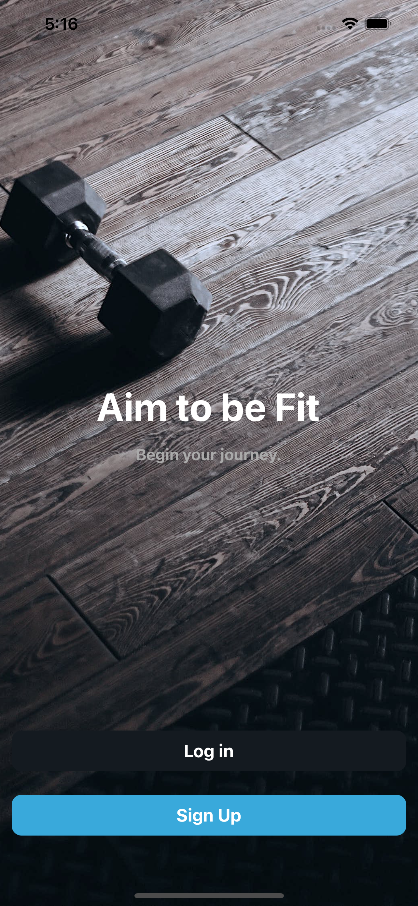
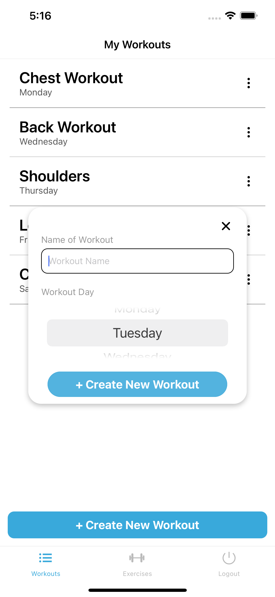
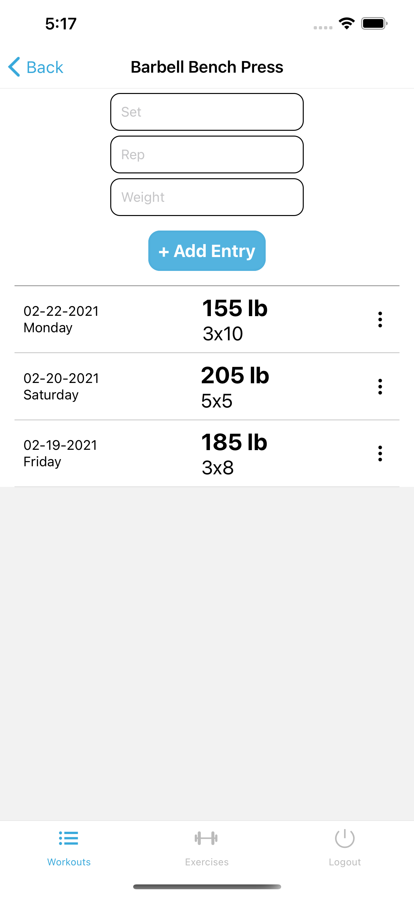

# AimFit Mobile
 * * *
 

 ## Live
 --------------

Demo (Through Expo Go Mobile App): [exp://exp.host/@@jessetran/aimfit-mobile](exp://exp.host/@@jessetran/aimfit-mobile)  
Client Repo: [https://github.com/jessetran03/aimfit-mobile](https://github.com/jessetran03/aimfit-mobile)  
Server Repo: [https://github.com/jessetran03/aimfit-api](https://github.com/jessetran03/aimfit-api)

## Summary
 --------------

 AimFit Mobile is a mobile application that helps you to reach your fitness goals. The application allows the user to create their own workouts and customize the workouts to their needs. The user can also assign a day to each workout to help them organize their weekly workout plan. The user can keep a log of the numbers they use for their exercises.

 ## Screenshots
  --------------
 Login Screen:
 

 Workout List Screen:
 

 Add Exercise Screen:
 

 Exercise Log Screen:
 

 ## Technologies Used
 --------------

 1. JavaScript
 2. React
 3. React Native
 4. Expo